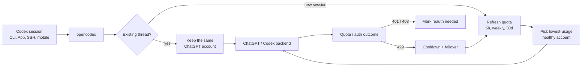

<h3 align="center">make codex open!</h3>
<p align="center"><b>Universal provider proxy for OpenAI Codex, Claude Code, Claude Desktop &amp; Grok Build</b><br>
Two commands, and every one of them runs any LLM you point it at.</p>

<p align="center">
  <a href="https://x.com/claudeebum"></a>
  <a href="https://www.npmjs.com/package/@bitkyc08/opencodex"></a>
  <a href="https://github.com/lidge-jun/opencodex/blob/main/LICENSE"></a>
  
</p>

```bash
npm install -g @bitkyc08/opencodex
ocx start        # proxy + dashboard on localhost:10100
```

<table align="center">
  <tr>
    <td width="50%" align="center">
      <br>
      <sub><b>Claude Code, running any model.</b><br>The picker is stock Claude Code. The brain behind it isn't.</sub>
    </td>
    <td width="50%" align="center">
      <br>
      <sub><b>Codex, running any model.</b><br>Pick a provider and go — same workflow, different brain.</sub>
    </td>
  </tr>
  <tr>
    <td width="50%" align="center">
      <br>
      <sub><b>Claude Desktop, running any model.</b><br>Opus answers, then hands the task to a GPT-5.6 Sol subagent.</sub>
    </td>
    <td width="50%" align="center">
      <br>
      <sub><b>Grok Build, running any model.</b><br>Sol drives the session and calls a Kimi K3 subagent.</sub>
    </td>
  </tr>
</table>

<p align="center">
  <a href="README.md">English</a> · <a href="readme/README.ko.md">한국어</a> · <a href="readme/README.zh-CN.md">简体中文</a> · <a href="readme/README.ru.md">Русский</a> · <a href="readme/README.ja.md">日本語</a> · 📖 <a href="https://opencodex.me/"><b>Full documentation →</b></a>
</p>

<p align="center">
  
</p>

Use Claude, Gemini, Grok, GLM, DeepSeek, Kimi, Qwen, Ollama, or any other LLM with Codex — and with **Claude Code**, **Claude Desktop**, and **Grok Build** — without waiting for anyone to add support.

Subagents cross the boundary too: Claude Desktop can answer as Opus and hand the next step to a
GPT-5.6 Sol subagent, and Grok Build can drive a session on Sol while calling Kimi K3 — each side
keeping its own native UI.

opencodex is a lightweight local proxy that translates Codex's Responses API into whatever your provider speaks. Streaming, tool calls, reasoning tokens, images — everything works, in both directions.

It can also manage a **ChatGPT account pool** for Codex auth. Add multiple ChatGPT / Codex accounts,
refresh their 5h / weekly / 30d quota in the dashboard, and let new sessions auto-route to the
lowest-usage healthy account. Existing Codex threads stay pinned to the account that started them,
so long SSH, tmux, or mobile-connected sessions do not jump accounts mid-conversation.

```
Codex CLI / App / SDK ──/v1/responses──▶ opencodex ──▶ Any provider
                                              │
              Anthropic · Google · xAI · Kimi · Ollama Cloud · Groq
              OpenRouter · Azure · DeepSeek · GLM · …and OpenAI itself
```



## Supported platforms

| OS | Status | Service manager |
|---|---|---|
| macOS (arm64 / x64) | Fully supported | launchd |
| Linux (x64 / arm64) | Fully supported | systemd (user unit) |
| Windows (x64) | Fully supported | Task Scheduler (hidden) / opt-in native service (`--native`, WinSW) |

Requires [Node](https://nodejs.org) 18+. The Bun runtime is bundled automatically on `npm install` — no separate Bun install needed. All three platforms work natively (no WSL needed on Windows).

## Quick start

```bash
# Install (bundles the Bun runtime automatically — only Node 18+ required)
# Prefer a user-owned Node (nvm/fnm) — avoid `sudo npm install -g …`
npm install -g @bitkyc08/opencodex

# Interactive setup (writes config, injects into Codex, and offers autostart shim install)
ocx init

# Start the proxy
ocx start

# If you skipped it during init, install the on-demand autostart shim later
ocx codex-shim install

# Use Codex normally — it now routes through opencodex
codex "Write a hello world in Rust"
```

<details>
<summary><b>"bundled Bun runtime is missing" / npm blocked Bun install scripts?</b></summary>

<br/>

opencodex bundles the Bun runtime as a dependency and runs it via a Node
launcher, so you do **not** need to install Bun yourself. If you see a
"bundled Bun runtime is missing" error, the install skipped lifecycle scripts
(including npm blocking bun's postinstall under `allowScripts`) or optional
dependencies. Reinstall without those flags, allowing bun's install script:

```bash
npm install -g --allow-scripts=bun @bitkyc08/opencodex   # no --ignore-scripts, no --omit=optional

# if the original install used sudo, keep using sudo:
sudo npm install -g --allow-scripts=bun @bitkyc08/opencodex
```

npm's own warning suggests an abbreviated command without the package name —
that would reinstall the current directory, so always pass
`@bitkyc08/opencodex` explicitly.

If you installed with `sudo` into a root-owned prefix, the sudo reinstall above
unblocks that prefix — but prefer migrating to a user-owned Node (nvm, fnm, or
a user npm prefix) when you can.

</details>

## Add a provider

The fastest way to add a provider is through the web dashboard:

```bash
ocx gui
```

This opens the dashboard at `http://localhost:10100`. From there:

1. Click **"Add Provider"**
2. Pick from **40+ built-in providers** — or enter a custom OpenAI-compatible endpoint
3. Paste your API key (or log in via OAuth for Anthropic, xAI, and Kimi)
4. Models are **auto-discovered** from the provider's `/v1/models` endpoint

Your new provider is ready to use immediately. No restart needed.

You can also add providers through `ocx init` (interactive CLI) or by editing `~/.opencodex/config.json` directly.

## Model routing

Target any configured provider and model using the `provider/model` syntax:

Providers whose own model ids contain `/` (zenmux, openrouter, nvidia, …) are exposed to
Codex with inner slashes aliased to `-` (e.g. `zenmux/moonshotai-kimi-k3-free`); the
proxy transparently routes them back to the native id, and the raw full-slash form keeps
working too.

```bash
# Use Claude Opus through Anthropic
codex -m "anthropic/claude-opus-5" "Explain this stack trace"

# Use Gemini through Google
codex -m "google/gemini-3-pro" "Write unit tests for auth.ts"

# Use GLM through Ollama Cloud
codex -m "ollama-cloud/glm-5.2" "Write a SQL migration"

# Use a local model through Ollama
codex -m "ollama/llama3" "Refactor this function"
```

When you omit the `provider/` prefix, opencodex routes to the default provider — or auto-matches based on the model name pattern (e.g., `claude-*` routes to Anthropic, `gpt-*` routes to OpenAI).

Combo aliases are exact public model ids and may be bare names or use a custom namespace. If a
combo alias exactly matches a configured non-OpenAI `provider/model` selector, the combo
intentionally takes precedence in routing, `/v1/models`, and the Codex catalog. Renaming that
alias or deleting the combo immediately restores the physical provider selector.

Routed models also appear in the **Codex App** model picker with per-model reasoning effort controls:

Current Codex builds can expose `low`, `medium`, `high`, `xhigh`, `max`, and `ultra` reasoning
controls when a model advertises them. opencodex keeps `xhigh` and `max` distinct unless a provider
config explicitly maps one to the other. `ultra` mirrors upstream Codex semantics: it selects
maximum reasoning plus proactive multi-agent delegation in the client, and is converted to `max`
before any request reaches a provider. Routed models advertise it only when a provider config opts
in via `reasoningEfforts`.

GPT-5.6 Sol/Terra/Luna are seeded as rollout-ready catalog entries for the OpenAI API key and
OpenRouter presets (`gpt-5.6-sol`, `gpt-5.6-terra`, `gpt-5.6-luna`; OpenRouter uses
`openai/...`). They remain preview-gated by upstream availability; opencodex only prepares the
routing and catalog metadata for accounts and providers that can serve them.

<p align="center">
  
</p>

## OpenAI provider account modes

| Provider ID | Route | Credential | Behavior |
|---|---|---|---|
| `openai` | Codex login | Main + added Codex accounts | Pool by default; optional Direct mode |
| `openai-apikey` | OpenAI API | API key/key pool | No Codex account routing |

- Pool includes the main Codex login and added accounts, with affinity, quota, cooldown, and failover.
- Direct short-circuits pool state and uses only the current caller/main-login bearer.
- Fresh installs and configs with no persisted mode default to Pool. Change the mode on the
  dashboard's **Providers** page; model ids stay bare in either mode.
- The legacy public provider id `chatgpt` is hidden after migration. The original config is retained
  once at `~/.opencodex/config.json.pre-openai-tiers-v2.bak`; restore it with
  `cp ~/.opencodex/config.json.pre-openai-tiers-v2.bak ~/.opencodex/config.json`.
- Current configs use `openaiProviderTierVersion: 2`. Earlier v1 three-provider configs migrate
  automatically into the single `openai` row.
- The API tier includes Pro virtual models (`gpt-5.6-sol-pro`, `gpt-5.6-terra-pro`,
  `gpt-5.6-luna-pro`). At the wire level, each rewrites to its base model with
  `reasoning.mode: "pro"`.
- Its catalog is fixed to eight ids: `gpt-5.5`, `gpt-5.6`, Sol/Terra/Luna, and the three
  corresponding Pro virtual ids. There is no generic `gpt-5.6-pro` alias.
- Compact requests keep the selected tier but send the base model without a reasoning object.
- Official API metadata is 1,050,000 context tokens and 922,000 max input tokens.

Use `gpt-5.6-sol` for the configured `openai` account mode and
`openai-apikey/gpt-5.6-sol` for the API key. Codex-login and API credentials never fall through to
one another.

### Pool account behavior

Open **Codex Auth** in the dashboard to add accounts and choose which account should handle the
next Codex session. opencodex keeps these behaviors:

- **Existing sessions keep affinity.** A thread id is bound to the selected account and reused on
  later turns, so a long request or a mobile/SSH-attached session keeps using the same account.
- **New sessions can auto-route.** When auto-switch is enabled, opencodex compares the hottest known
  quota window across 5h, weekly, and 30d usage, then picks a lower-usage eligible account for new
  sessions once the active account crosses the threshold.
- **Quota lookup is built in.** The dashboard can refresh all account quotas in one click, and the
  request log labels pool traffic with non-PII account ordinals.
- **Failures fail closed.** Token failures mark reauthentication instead of falling back to another
  credential silently; 429 quota responses put the account in cooldown and can fail over future work
  to another eligible pool account.

## Highlights

- **Use any LLM with Codex.** 5 protocol adapters cover Anthropic Messages, Google Gemini, Azure, OpenAI Responses passthrough, and every OpenAI-compatible Chat Completions endpoint — that's 40+ providers out of the box.
- **Use any LLM with Claude Code too.** The same daemon serves the Anthropic Messages API (`/v1/messages` + `count_tokens`): `ocx claude` launches Claude Code fully wired, and routed models appear in its native `/model` picker via gateway model discovery (`claude-ocx-<provider>--<model>` aliases, Claude Code 2.1.129+). Configure slots and model maps on the dashboard's Claude page. The Claude page also carries a separate Desktop profile with Opus, Fable, Sonnet, and Haiku families, accessible drag/keyboard controls, and JSON import/export.
- **Use any LLM with GitHub Copilot App too.** Point Copilot's Model providers at `http://127.0.0.1:10100/v1` — OpenCodex serves OpenAI-compatible `GET /v1/models` and `POST /v1/chat/completions` so routed models sync into the app. See [docs/github-copilot-app.md](docs/github-copilot-app.md).
- **Pool ChatGPT accounts safely.** Keep existing Codex threads on one account while new sessions
  can auto-pick a lower-usage account from the pool, with quota refresh and non-PII request labels.
- **Log in once, skip the API key.** OAuth support for xAI, Anthropic, and Kimi means you can authenticate with your existing account. Tokens auto-refresh. Or forward your `codex login`, paste an API key, or use `${ENV_VAR}` references — your call.
- **Works everywhere Codex does.** Injects into Codex CLI, TUI, App, and SDK automatically. Routed models show up in Codex's model picker just like native ones.
- **History-safe injection.** On local installs the proxy points Codex's own built-in `openai` provider at itself via a single `openai_base_url` line — new threads keep their native provider tag, so ongoing chat history is never remapped and an unclean shutdown can't hide it. (Threads re-tagged by older versions are migrated back once on the first start; remote/LAN binds use a dedicated provider entry instead, since they need an API-key header.)
- **Delegate to the right model.** Feature up to five routed or native models in Codex's subagent picker from the dashboard or config — route complex tasks to a reasoning model, fast tasks to a cheap one. On the v2 multi-agent surface (GPT-5.6 Sol/Terra) the proxy injects compact, schema-agnostic delegation guidance: an eligible preferred sub-agent model and effort (`injectionModel` / `injectionEffort`), the configured intersection of Codex's picker-visible, v2-compatible, priority-sorted first five with available effort ladders, and the `fork_turns` rules that let cross-model `spawn_agent` calls apply their overrides. Known limitation: when a native parent spawns a routed child, the task body can currently arrive backend-encrypted and be lost ([#92](https://github.com/lidge-jun/opencodex/issues/92)) — use the v1 surface for reliable cross-provider delegation. Want your own wording? Set `injectionPrompt` with `{{model}}` / `{{effort}}` / `{{roster}}` placeholders.
- **Prepare for preview-gated OpenAI rollouts.** GPT-5.6 Sol/Terra/Luna entries preserve the upstream effort ladders. Direct/Multi use the 372k Codex contract; OpenAI API and OpenRouter use 1.05M metadata when upstream access is available.
- **Give any model superpowers.** Non-OpenAI models get real web search and image understanding via a `gpt-5.4-mini` sidecar over your ChatGPT login.
- **Generate images natively.** Codex's standalone `image_gen` tool uses `POST /v1/images/generations` for generation and `POST /v1/images/edits` for edits; it is separate from the hosted Responses `image_generation` tool.
- **See what's happening.** The web dashboard shows providers, OAuth status, model selection, and a live request log, including cached/cache-write token counts when upstream reports them — no more guessing why a request failed.
- **Runs in the background.** Install as a system service (launchd / systemd / Task Scheduler) and forget about it. On macOS/Linux the proxy starts at login; on Windows the default Task Scheduler backend starts at logon (windowless), or use `ocx service install --native` for a real Windows service that starts at boot.
- **Clean exit, zero residue.** `ocx stop` (or the dashboard's Stop button) shuts down the proxy, stops the background service if one is installed, and restores Codex to its original configuration. Plain `codex` works exactly as it did before — no leftover config, no orphaned processes.

## Providers & adapters

| Provider | Adapter | Auth |
|---|---|---|
| OpenAI (ChatGPT login) | `openai-responses` | forward (no key) |
| OpenAI (API key) | `openai-responses` | key |
| Umans AI Coding Plan | `anthropic` | key |
| Anthropic Claude | `anthropic` | oauth / key |
| xAI Grok | `openai-chat` | oauth / key |
| Kimi (Moonshot) | `openai-chat` | oauth / key |
| Google Gemini | `google` | key |
| Azure OpenAI | `azure-openai` | key |
| Cursor (experimental) | `cursor` | dashboard/local config; live transport; unsafe native local exec is opt-in |
| Ollama Cloud + 17-provider catalog | `openai-chat` | key |
| Ollama / vLLM / LM Studio (local) | `openai-chat` | key (usually blank) |
| Any OpenAI-compatible endpoint | `openai-chat` | key |

Plus DeepSeek, Groq, OpenRouter, Together, Fireworks, Cerebras, Mistral, Hugging Face, NVIDIA NIM, MiniMax, Qwen Cloud, Tencent Cloud Coding Plan, SiliconFlow, and more. See the full list with `ocx init` or in the [provider docs](https://opencodex.me/reference/configuration/).

Cursor support is a staged experimental bridge: it appears in `ocx init` and the dashboard Add
Provider picker as a local config with Cursor's static public model catalog. Live
HTTP/2 transport is enabled when a Cursor access token is configured. Cursor server-driven native
read/write/delete/ls/grep/shell/fetch execution is disabled by default because it bypasses Codex's
approval and sandbox path. Request text such as a Codex `danger-full-access` sandbox marker never
authorizes native local exec; set `nativeLocalExec: "on"` only for trusted local experiments where
every data-plane caller is trusted. `nativeLocalExec: "codex-sandbox"` is accepted for backwards
compatibility but fails closed like `off`; legacy `unsafeAllowNativeLocalExec: true` remains an
explicit operator opt-in.
MCP, screen recording, and computer-use are exposed through executor hooks; when no local executor
is configured, opencodex returns typed no-executor results instead of policy-blocking the request.
Cursor OAuth and live model discovery are enabled for the experimental Cursor adapter.

## CLI

```bash
ocx init                       # interactive setup
ocx start [--port 10100]       # start the proxy; falls back to a free port if busy
ocx stop                       # stop + restore native Codex
ocx restore                    # restore without stopping (alias: ocx eject)
ocx uninstall                  # remove service/shim/config and restore native Codex
ocx ensure                     # start if needed + refresh Codex config/cache
ocx sync                       # refresh models + re-inject into Codex
ocx codex-shim install         # run `ocx ensure` whenever `codex` is launched
ocx status                     # is the proxy running?
ocx login <provider>          # OAuth login (xai, anthropic, kimi, cursor, ...)
ocx logout <provider>          # remove a stored login
ocx account <list|current|use> # list/switch accounts & API-key pools (masked; also refresh/auto-switch/remove/add-key)
ocx gui                        # open the web dashboard
ocx claude [args...]           # launch Claude Code wired to the proxy (model discovery on)
ocx claude desktop             # save and apply the Claude Desktop four-family profile
ocx service [install|start|stop|status|uninstall]   # install/update/start background service
ocx update [--tag preview]     # update opencodex; preview installs stay on @preview
```

### Claude Desktop profile

The dashboard's **Claude → Desktop** view sorts routes into four families: Opus, Fable, Sonnet,
and Haiku. New routes start in Opus, and the first Opus route is the initial application default.
Every non-empty family has one default. You can drag a route, or use its visible move control with
a mouse, touch, or keyboard. **Save and apply** writes the profile to Claude Desktop. JSON export
and import are available for backup or moving the same setup to another machine.

If Claude Desktop's footer picker does not change the model for an already-running 3P
conversation, use `/model <id>` in that conversation. OpenCodex routes the model id carried by
each request; **Logs → requestedModel** shows which id Desktop actually sent.

```bash
ocx claude desktop [apply]                         # save and apply the current profile
ocx claude desktop show [--json]                   # inspect routes, families, and defaults
ocx claude desktop move <route> <family> [--default]
ocx claude desktop default <family> <route|none>
ocx claude desktop export <path|->                 # use - to write JSON to stdout
ocx claude desktop import <path> [--apply]         # validate, then save; optionally apply
```

Families are `opus`, `fable`, `sonnet`, and `haiku`. Non-Anthropic routes receive stable
Claude-shaped aliases with a synthetic 2026 date slot; that date is an internal slot, not the
model's release date. Real Anthropic Claude routes keep their real model ids. Use `none` only for
an empty family; a non-empty family always needs a default. The older apply forms
`ocx claude desktop --static`, `--hybrid`, and `--discovery-only` remain supported.

### Autostart: service vs shim

opencodex has two ways to auto-start the proxy:

| | `ocx service` / `ocx service install` | `ocx codex-shim install` |
|---|---|---|
| **How** | OS service manager (launchd / systemd / schtasks) | Wraps script launchers for `codex`; real `codex.exe` is left untouched |
| **When** | Always running after login | On-demand — runs `ocx ensure` when `codex` is launched |
| **Restart** | Auto-restarts on crash | Starts once per `codex` invocation |
| **Codex updates** | Unaffected | A completed stable launcher replacement is repaired by the next ordinary `ocx` command |
| **Remove** | `ocx service uninstall` | `ocx codex-shim uninstall` |

Use the **service** for always-on proxy (recommended for development machines). Use the **shim** for
lightweight, on-demand proxy startup without a background daemon. Shim autostart is enabled by default
and can be disabled from the GUI dashboard. If the configured proxy port is already busy, `ocx start`
automatically picks another free local port and updates Codex to use it.

If an external Codex update overwrites an installed shim, the next ordinary `ocx` command backs up
the stable new launcher and restores the shim. A launcher that is still changing is left untouched
and retried later. Repair failures warn without failing the requested command; use
`ocx codex-shim install` as the manual fallback. Set `codexShimAutoRestore` to `false`, or set
`OPENCODEX_CODEX_SHIM_AUTO_RESTORE=0` for a process-level opt-out.

### Uninstall

Before removing the npm package, clean up local state:

```bash
ocx uninstall
npm uninstall -g @bitkyc08/opencodex
```

`ocx uninstall` stops the proxy, removes any installed service, removes the Codex shim, restores
native Codex config/catalog/history, and deletes `~/.opencodex`.

## Configuration

Config lives at `~/.opencodex/config.json`. If the file cannot be parsed (e.g. truncated or
manually broken JSON), opencodex backs it up to `config.json.invalid-<timestamp>`, prints a warning,
and falls back to defaults — so your original file is never silently lost.

Here's a typical multi-provider setup:

```json
{
  "port": 10100,
  "defaultProvider": "anthropic",
  "providers": {
    "anthropic": {
      "adapter": "anthropic",
      "baseUrl": "https://api.anthropic.com",
      "authMode": "oauth",
      "defaultModel": "claude-sonnet-4-6"
    },
    "ollama-cloud": {
      "adapter": "openai-chat",
      "baseUrl": "https://ollama.com/v1",
      "apiKey": "${OLLAMA_API_KEY}",
      "defaultModel": "glm-5.2"
    }
  }
}
```

Provider entries can also annotate routed catalog metadata and output defaults. Use `contextWindow`
for a provider-wide Codex-visible context cap, `modelContextWindows` for model-specific caps, and
`modelInputModalities` for model-specific catalog input hints such as `["text"]` or
`["text", "image"]`. For Responses models that reject Codex reasoning-summary delivery fields, set
`modelSupportsReasoningSummaries.<model-id>` to `false`; this updates the catalog and strips stale
summary-delivery fields at the adapter boundary. For OpenAI-compatible chat providers whose upstream default response budget is
too small, set `defaultMaxOutputTokens` or per-model `modelMaxOutputTokens`; explicit
`max_output_tokens` from the client still wins, and unset configs still omit `max_tokens`. Context
values cap live `/models` metadata; they never raise a smaller live context window. The bundled
GPT-5.6 Sol/Terra/Luna fallback metadata uses a 1,050,000-token context window for OpenAI API key
and OpenRouter catalog entries; it does not bypass upstream preview access. See the configuration
reference for the full field list.

> **GLM-5.2 1M context via Z.AI:** through the `openai-chat` adapter, both `glm-5.2`
> and `glm-5.2[1m]` work — opencodex strips the trailing `[1m]` suffix before
> sending the request, since OpenAI-compatible endpoints reject the bracketed id
> (Z.AI 400 code 1211). The `[1m]` suffix is a Claude-Code / Anthropic-endpoint
> convention; to use it natively, point the `anthropic` adapter at Z.AI's coding
> base (`https://api.z.ai/api/coding/paas/v4`). Set the 1M context window via the
> model catalog (`modelContextWindows`), not the model name.

Local models work too. Point opencodex at any OpenAI-compatible server running on your machine:

```json
{
  "port": 10100,
  "defaultProvider": "ollama",
  "providers": {
    "ollama": {
      "adapter": "openai-chat",
      "baseUrl": "http://localhost:11434/v1",
      "authMode": "key",
      "apiKey": "",
      "defaultModel": "llama3"
    },
    "vllm": {
      "adapter": "openai-chat",
      "baseUrl": "http://localhost:8000/v1",
      "authMode": "key",
      "apiKey": "",
      "defaultModel": "Qwen/Qwen3-32B"
    }
  }
}
```

WebSocket transport is off by default. Set `"websockets": true` only if you want Codex to advertise and use the Responses WebSocket path instead of HTTP/SSE.

### Remote access

By default opencodex binds to `127.0.0.1` (loopback) and requires no extra authentication.
If you set `"hostname": "0.0.0.0"` to expose the proxy on the LAN, opencodex requires a bearer token
to protect both the management API (`/api/*`) and the data-plane (`/v1/responses`,
`/v1/images/generations`, and `/v1/images/edits`):

```bash
export OPENCODEX_API_AUTH_TOKEN="your-secret-token"
ocx start
```

The proxy refuses to start without this variable when binding beyond loopback. If you install a
background service for LAN access, export the same variable before `ocx service install` so the
service manager receives it.
Clients (scripts, remote machines) must include the token in every request:

```
x-opencodex-api-key: your-secret-token
```

The token is compared in constant time to prevent timing attacks.

opencodex automatically remaps Codex resume history so old OpenAI chats and opencodex-created project
threads stay visible in Codex App while the proxy is active. opencodex records the original provider/source metadata in
`~/.opencodex/codex-history-backup.json`. `ocx stop` / `ocx restore` restores backed-up OpenAI rows
to OpenAI, and ejects any remaining opencodex user threads to OpenAI as well so native Codex does not
try to resume a thread whose provider no longer exists in `config.toml`.

If you tested an older development build where `syncResumeHistory` already remapped history before
backup support existed, you can also run the explicit recovery command:

```bash
ocx recover-history --legacy-openai
```

See the **[Configuration reference](https://opencodex.me/reference/configuration/)** for every field.

## Documentation

The public docs — install, providers, routing, sidecars, Codex integration, Codex App model picker, and CLI/config reference — are built from [`docs-site/`](./docs-site) and published to **[opencodex.me](https://opencodex.me/)**.

Maintainer source-of-truth notes live under [`structure/`](./structure). Historical investigations remain under [`docs/`](./docs).
Contributor setup lives in [`CONTRIBUTING.md`](./CONTRIBUTING.md), and security reporting guidance
lives in [`SECURITY.md`](./SECURITY.md).

## Development

Source development requires the `bun` CLI on your `PATH`. This is separate from the published npm
package's bundled Bun runtime, which is used only by installed `ocx` commands.

```bash
git clone https://github.com/lidge-jun/opencodex.git
cd opencodex
bun install
bun run dev:proxy    # start the proxy API in dev mode
bun run dev:gui      # start the dashboard dev server in another terminal
bun run build:gui    # build the packaged dashboard into gui/dist
bun x tsc --noEmit   # typecheck
```

`bun run dev` remains an alias for `bun run dev:proxy` for compatibility. In a source checkout,
the proxy API exposes `/healthz`, `/v1/responses`, `POST /v1/images/generations`,
`POST /v1/images/edits`, and `/api/*`; `GET /` serves the packaged dashboard only after
`bun run build:gui` has produced `gui/dist`. While hacking on the dashboard, run the frontend separately:

```bash
bun run dev:gui
```

See **[Contributing](./CONTRIBUTING.md)**.

## Disclaimer

opencodex is an independent, community-maintained project and is **not affiliated with or endorsed by OpenAI, Anthropic, or any other provider**.

Some providers — notably Anthropic (Claude) — may suspend or restrict accounts that route API traffic through third-party proxies. **Use at your own risk (UAYOR).** Before connecting a provider, review its Terms of Service to confirm that proxy-based access is permitted. The opencodex maintainers are not responsible for any account actions taken by upstream providers.

## License

MIT
