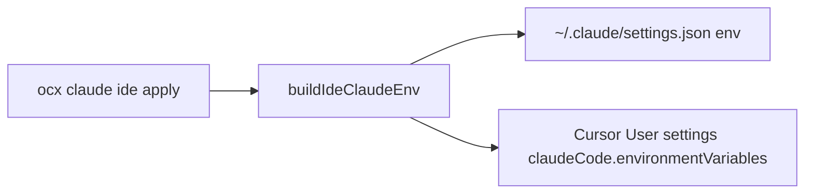

## Context

`ocx claude` injects env only into the spawned CLI. Cursor’s Claude Code extension reads `claudeCode.environmentVariables` and Claude `settings.json` `env`. No writer existed.

## Decisions

1. **Dual write by default** — Claude home `env` + Cursor User `claudeCode.environmentVariables` when Cursor settings path exists.
2. **Same token policy as `buildClaudeEnv`** — admission key if `apiKeys` exist; else proxy marker only when markerMode is proxy; omit token for subscription pierce.
3. **Revert removes only managed keys** — never wipe unrelated `env` / Cursor settings.
4. **Stale model warning** — if `settings.model` references a deleted provider alias (e.g. `anthropic-apikey`), warn and clear it on apply.

## LDA-PO

### Logic
- apply: merge managed keys into both stores; preserve other keys
- show: print resolved paths + env that would be / is applied
- revert: delete managed keys from both stores

### Data
| Key | Source |
|-----|--------|
| ANTHROPIC_BASE_URL | live proxy port or config.port |
| ANTHROPIC_AUTH_TOKEN | apiKeys[0] or PROXY_MARKER or omit |
| CLAUDE_CODE_ENABLE_GATEWAY_MODEL_DISCOVERY | `1` |
| CLAUDE_CODE_PROVIDER_MANAGED_BY_HOST | `1` only when token set |

### Architecture

### Portal
- `src/claude/ide-settings-env.ts`

### Others
- Verify: unit tests with temp dirs; apply on this machine after ship
