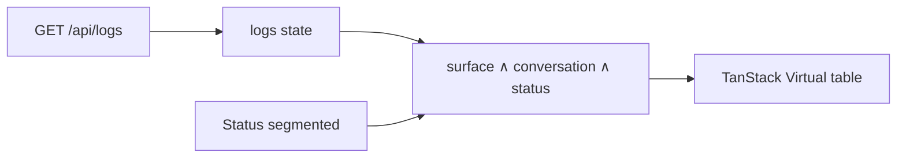

## Context

Logs (`gui/src/pages/Logs.tsx`) uses a Surface segmented control + Conversation search, then virtualizes `filteredLogs`. Backend `filterRequestLogs` already supports `status=2xx|4xx|5xx` or an exact code; GUI fetch ignores query params.

## Goals / Non-Goals

- Goal: fast visual triage of success vs client vs server failures on the loaded ring.
- Non-goal: exact-code picker, URL hash sync for status, or API query wiring in v1.

## Decisions

1. **Client-side class buckets (All / 2xx / 4xx / 5xx)** — mirrors Surface UX; no refetch when switching buckets.
2. **Parent status only** — match `entry.status`, not attempt rows (aligned with `filterRequestLogs` + existing tests).
3. **Pure helper portal** — `matchesLogStatusFilter(status, filter)` in `gui/src/log-status-filter.ts`, semantics aligned with `/^[1-5]xx$/` server logic for the three exposed classes.
4. **Empty state** — when filters exclude all rows but the ring is non-empty, show a dedicated “no matches” copy (not “No requests yet”).

## LDA-PO

### Logic

- Default filter: `all` (no status constraint).
- `2xx` → `Math.floor(status/100) === 2`; same for 4 and 5.
- Surface + conversation + status are AND.
- Invalid / missing status cannot appear from API; treat non-finite as non-match when filter ≠ all.

### Data structure

| Concept | Where | Notes |
|---------|-------|-------|
| `statusFilter` | `Logs` React state | `"all" \| "2xx" \| "4xx" \| "5xx"` |
| `LogEntry.status` | API JSON | HTTP status number |
| i18n keys | `logs.filter.status.*` | label + all/2xx/4xx/5xx + empty |

### Architecture

### Portal

- File: `gui/src/log-status-filter.ts`
- Reuse: Logs list only in v1; same helper can later drive URL/`?status=` if needed.

### Others

- Scope: Logs tab list only.
- Verify: unit tests for helper; GUI test click 4xx hides 200 rows; `bun run lint:i18n` / focused gui tests.
- Risk: low; no backend change.

## Risks / Trade-offs

- Client filter only sees the in-memory ring (same as Surface). Acceptable; documented for Conversation totals already.
- Omitting 3xx / 1xx buckets: rare in this proxy; amber column color covers them under All.

## Migration

None.
